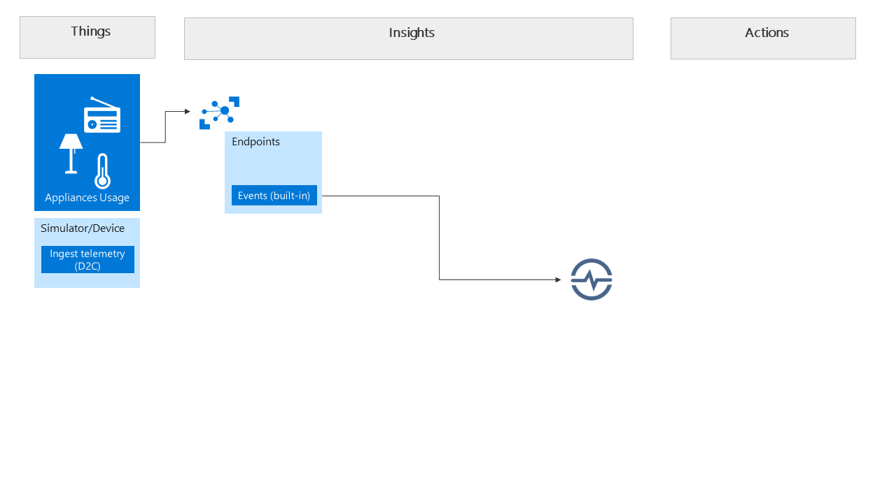

# Azure IoT WS - Part 1

> In this section we will create an Azure IoT Hub, Time Series Insights and setup ingestion from a device simulator.
IoT Hub is leveraged as the Cloud Gateway for device identity and telemetry ingest. Time Series Insights is leveraged to analyze unstructured (telemetry) data coming from the devices.

### Create Azure resources

1. Create a new Resource Group. We recommend giving it a clear prefix like `initials-datedigits`. For example `kdg10247-rg`.
1. Create an Azure IoT Hub - we recommend to choose S1 as the SKU size. If you would like to use the Free tier note that you will not be able to complete the labs as you require more routing options than possible on this SKU. You can use the default settings.
1. Once your IoT Hub is created, go to Endpoints > Built-in Endpoints > Events. 
    1. Add a consumer group named `timeseries`.
1. Create a new device to your IoT Hub. You can use the Device Explorer pane in the IoT Hub on Azure Portal. You will need to take note of the connection string properties of this device for the next steps below. 
    Optional: use IoT Hub ***Device Explorer*** tool (see pre-requisites) or the CLI tool ***iothub-explorer*** to create your device instead.
1. Create a Time Series Insights service.
    1. Once the service is created, go to 'Data Access Policies'. Add your own account to the Reader (and optionally Contributor) permission. This is required to be a reader of the data in the Time Series Insights UI environment.
    1. Add an Event Source to consume data from the IoT Hub you created earlier, and make sure to use the `timeseries` consumer group.

### The simulator for ingestion of telemetry

1. Use the Raspberry Pi online simulator: 
[https://docs.microsoft.com/en-us/azure/iot-hub/iot-hub-raspberry-pi-web-simulator-get-started](https://docs.microsoft.com/en-us/azure/iot-hub/iot-hub-raspberry-pi-web-simulator-get-started)
1. Enter the connection string to your newly created device (copy the primary connection string from the _device's properties pane_ in the Azure Portal). 
1. Change the Telemetry message the simulator is sending to the cloud and add a field named `consumption` with a random value to the Message. 
1. Run the simulator and validate the message sent contains a consumption value. Keep it running for a few minutes to get some data in your IoT Hub.

### End result
1. After ingesting telemetry you should be able to dive into the telemetry data using your Time Series Insights service.
1. Open your Time Series account and review ingested data, browse and filter to dive into telemetry details.
    1. ***Note: if you want to see a more complete sample of Time Series Insights data, you can go to this demo: (https://insights.timeseries.azure.com/demo)[https://insights.timeseries.azure.com/demo].***

### Other parts in this lab

1. [Part 2](part2.md)
1. [Part 3](part3.md)
1. [Part 4](part4.md)
