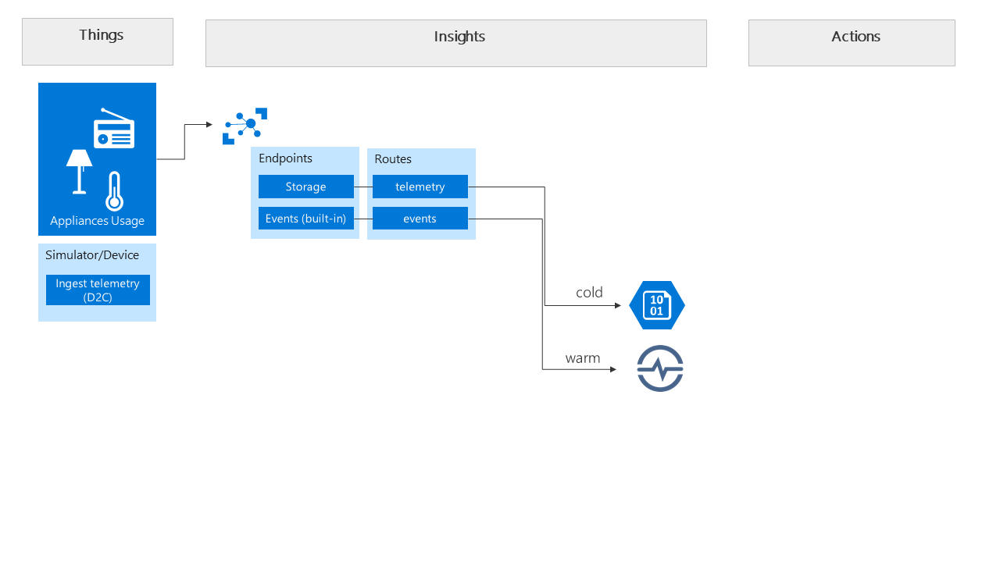

# Azure IoT WS - Part 2

> In this lab we leverage IoT Hub Routes and endpoints to automatically store all telemetry messages coming in into Storage Blobs. When you use Routes, you also need to add a route for the default Events endpoint if you want to keep receiving messages into it.
<<<<<<< HEAD
=======

>>>>>>> part02

### Add a Storage account
1. Create a new Storage account in your resource group.
1. It can be a locally redundant storage.
1. Use Azure Storage Explorer to create a new container named `telemetryarchive`. You will need this in the next step.

### Add the route(s)

1. In your Iot Hub, add an endpoint to the newly created Storage account.
1. Make sure you refer to the previsouly created storage container `telemetryarchive`.
1. Go to the Routes section and add a route to deliver all Device Messages to the newly created Storage endpoint. For now we want to store all telemetry so leave the condition empty (all=tue). 
1. Add a second route to route all Device Messages to the built-in endpoint Events. This is required otherwise the already configured consumer group to deliver messages to Time Series Insights will stop receiving telemetry.

### End result 

1. Using the online simulator or the Smart meter simulator see [Part 1](part1.md), make sure you have ingest of telemetry.
1. Go to your Storage account and validate you are getting all telemetry stored into blobs. The format will be Avro.
1. Validate also that you are still getting the ingest into Time Series Insights.

