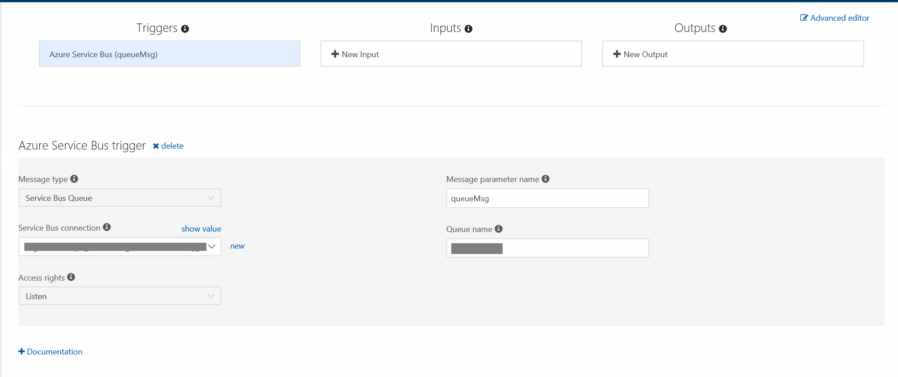

# Azure IoT WS - Part 4

> In part four we are further completing the scenario: implement an event processor to analyze data coming in. Through Stream Analytics we calculate consumption of a device and take action based on values surpassing a certain threshold. We leverage a Service Bus Queue which is picked up by an Azure Function to act upon the trigger and send a command (DirectMethod) to the device to shut something off. Power BI is also used to build a dashboard.


### Create Service Bus Queue and new consumer group in IoT Hub

1. Create a new Service Bus account in your Resource group.
1. Create a Queue - if you prefer you can leverage Topics but for this exercise a Queue is fine.
1. In your existing IoT Hub account, go to your Endpoints. 
    1. Under the built-in Events endpoint, add a new Consumer group. Name it `asaconsumergroup`. See why we are adding a new consumer group per 'consumer' application of the events [here](https://docs.microsoft.com/en-us/azure/stream-analytics/stream-analytics-define-inputs#create-data-stream-input-from-event-hubs).

### Azure Stream Analytics to process hot data

> In this section, we'll leverage Azure Stream Analytics as the event stream processor. Azure Stream Analytics will get data from the IoT Hub and deliver 2 outputs: near real-time data directly to Power BI (optional), and a message into a Service Bus based on a calculation of energy usage by a device/system during a period of time.

1. Create a new Azure Stream Analytics account. You can use S1 as the SKU. Not if you are also doing the Power BI exercise: we are using several queries and outputs, you should scale out to 2 instances. You can scale down right after trying out the exercise to save costs.
1. Create an Input:
    1. Choose IoT Hub as the type of input.
    1. Name the output `hub`.
    1. Connect to your IoT Hub account, and use the consumer group name `asaconsumergroup`.
1. Create an Output:
    1. Name the output `QueueShutDown`
    1. Service Bus Queue as type of output.
    1. Select the Service bus created earlier.
1. Add a Query
```
SELECT
    IoTHub.ConnectionDeviceId AS DeviceId,
    AVG (consumption) AS [AverageConsumption],
        COUNT(*) as HowManyTimes 
INTO
    [QueueShutDown]
FROM [hub] TIMESTAMP by EventEnqueuedUtcTime
GROUP BY
    IoTHub.ConnectionDeviceId,
    TumblingWindow(second, 60)
HAVING 
AVG(consumption) > 30

```

5. You can test your query before starting it. To do this, the Query pane:
    1. Make sure you have some telemetry running. 
    1. Right-click the elipsis on the Input `hub` and choose `Sample data from input`.
    1. Leave the defaults of 3 minute data collection.
    1. You will receive a notification once the data collection is finished. Leave the Query pane open.
    1. Click ***Test*** at the top bar to test your query based on collected data and validate the results.
6. Once you are happy with the results you can start your Azure Stream Analytics job.

### Azure Function to take action towards the device

1. Create a new Azure Function App in your resource group.
1. Add a Function named `shutdownusage`. You can use the C# Service Bus Queue Trigger as template, or use an empty one.
1. Leverage the code under `../src/functions/shutdownusage/run.csx` as the body of the function. 
1. Under the Function Apps's **App Settings**, add a connection string to IoT Hub. You can copy the connection string from the IoT Hub's Shared access policies screen (leverage iothubowner).
    1. Name the connection string `Azure_IoT_ConnectionString`.
1. Add a binding connecting to the Service Bus Queue.

1. Add the project.json file as found in `../src/functions/shutdownusage`.
1. To test your function:
    1. Make sure you have the simulator running and a registered event handler for the method named `stop`. By default the Raspberry Pi online simulator already has a handler registered:
    ```
    client.onDeviceMethod('stop', onStop);
    ```
    3. You can use the following input to Test your function:
    `{"deviceid":"[sampleDevice]","averageconsumption":30.0,"howmanytimes":3}`
1. With the simulator sending data, validate that you receive a 'Stop' command in the simulator after the function triggers.


## Optional: add a Power BI report

1. Configure your Power BI account if you don't already have one.
1. Leverage the existing Stream Analytics job to add a query that serves primarily as a pass-through to take all messages as push them to Power BI.
````
SELECT
    *
INTO
    [YourPBIInputName]
FROM
    [hub]

````
1. You can now create a report leveraging the Streaming Data from the Stream Analytics job.


### End Result
Make sure you clean up your resources to stop consuming Azure resources. If you have created everything in the same resource group as recommended, you can simply delete the resource group via the Azure Portal UI.

### Other parts in this lab

1. [Part 1](part1.md)
1. [Part 2](part2.md)
1. [Part 3](part3.md)
